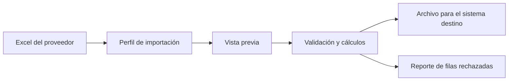

# TPI Final — Desiderio Lucas, Vazquez Franco
### Tecnicatura Universitaria en Programación a Distancia (UTN)

> **Motor configurable para importación, homologación, transformación y exportación de listas de productos de distintos proveedores.**

Los pequeños negocios reciben listas de precios en Excel de cada proveedor, todas con estructuras distintas, y hoy las pasan a mano (2–3 h por semana) al formato fijo que acepta su sistema. Este proyecto hace esa transformación de forma **configurable, repetible, validada y trazable**: el usuario define una vez el *contrato* de cada proveedor y el sistema lo ejecuta en cada lista nueva.



---

## 📌 Entrega actual: 2.ª — Diseño y Módulos (Condición de Regular)

| Entregable | Documento |
| --- | --- |
| Esquema de la base de datos (PostgreSQL) | [docs/esquema-base-de-datos.md](docs/esquema-base-de-datos.md) · [database/schema.sql](database/schema.sql) |
| Listado de módulos a desarrollar | [docs/modulos.md](docs/modulos.md) |
| Respuesta a las devoluciones del tutor | [docs/devoluciones.md](docs/devoluciones.md) |

---

## 📚 Documentación

| # | Documento | Contenido |
| --- | --- | --- |
| 1 | [Consignas del Trabajo Final](docs/consignas.md) | Entregas, pautas de documentación y criterios de evaluación |
| 2 | [Problema y alcance](docs/problema-y-alcance.md) | Problema, solución, definición de "homologar", stack, MVP, riesgos |
| 3 | [Análisis del dataset](docs/analisis-dataset.md) | Qué muestran los Excels reales y qué decisiones se toman a partir de ellos |
| 4 | [Contrato de importación](docs/contrato-de-importacion.md) | Qué define un perfil, operaciones soportadas, vista previa, errores |
| 5 | [Esquema de base de datos](docs/esquema-base-de-datos.md) | Diagrama ER, tablas, decisiones de diseño |
| 6 | [Módulos](docs/modulos.md) | Arquitectura, módulos P0/P1, endpoints, plan de trabajo |
| 7 | [Devoluciones](docs/devoluciones.md) | Cada punto del tutor y dónde se responde |
| — | [1.ª entrega (historial)](docs/entregas/entrega-1.md) | Versión original, sin cambios |

## 🗂️ Estructura del repositorio

```
├── README.md
├── docs/                 documentación (Markdown + Mermaid)
│   └── entregas/         entregas ya presentadas
├── database/
│   ├── schema.sql        DDL PostgreSQL
│   └── seed.sql          formato destino + perfil del primer caso real
└── dataset-example/
    ├── dataset-providers/          Excels tal como los envían los proveedores
    └── dataset-previous-platform/  Excels corregidos a mano (resultado esperado)
```

`backend/` (Spring Boot) y `frontend/` (React) se suman con el desarrollo. Ver la [estructura prevista](docs/modulos.md#4-estructura-del-repositorio).

## 🛠️ Stack

Java 17 · Spring Boot · Apache POI · PostgreSQL · React · Vite · Tailwind · Netlify · Railway

## 🔗 Repositorio

[fraanv1999/TPIFinalDesiderioVazquez](https://github.com/fraanv1999/TPIFinalDesiderioVazquez)
