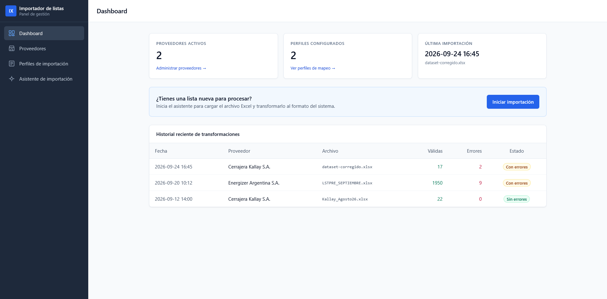

# TPI Final — Desiderio, Vazquez

Tecnicatura Universitaria en Programación a Distancia (UTN)

## Integrantes

- Lucas Desiderio
- Franco Vazquez

## Problema

Los pequeños negocios reciben listas de precios en Excel de varios proveedores. Cada lista tiene un formato distinto, y hoy se pasan a mano al formato fijo que acepta su sistema: eso lleva entre 2 y 3 horas por semana y genera errores en precios y códigos.

## Solución

Un sistema que importa la lista del proveedor, la transforma según un **perfil** configurado una vez por proveedor y exporta un archivo listo para el sistema destino.

El perfil indica qué hoja leer, en qué fila están los encabezados, qué representa cada columna y qué cálculos aplicar (IIBB, ganancia, IVA). Las filas con errores se informan, no se descartan en silencio.


## Demo del Frontend



## Tecnologías

| Capa | Tecnología |
| --- | --- |
| Frontend | React + Tailwind (Netlify) |
| Backend | Java + Spring Boot (Railway) |
| Base de datos | PostgreSQL (Railway) |

## Documentación

- [Base de datos](docs/base-de-datos.md)
- [Módulos](docs/modulos.md)
- [Entregas y devoluciones](docs/entregas.md)

## Estructura

```
├── database/          scripts SQL (schema.sql, seed.sql)
├── dataset-example/   Excels reales de proveedores y de la plataforma anterior
├── frontend/           demo de React + Tailwind (Vite)
└── docs/              documentación
```

## Instalación

### Base de datos

```bash
psql -d tpi_final -f database/schema.sql
psql -d tpi_final -f database/seed.sql
```

### Frontend (demo)

```bash
cd frontend
npm install
npm run dev
```

Abrí `http://localhost:5173` en el navegador. Es una demo de interfaz con datos simulados (sin conexión a backend todavía).

### Backend

Se agrega cuando esté el código.
