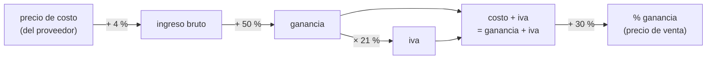

# Análisis del dataset

[← Volver al README](../README.md)

Este análisis se hizo sobre los Excels reales de [`dataset-example/`](../dataset-example). Es la base del [contrato de importación](contrato-de-importacion.md) y del [esquema de base de datos](esquema-base-de-datos.md).

---

## 1. Planillas de proveedores (`dataset-providers`)

### 1.1 `Lista Ferreteria 19 08.xlsx` — primer caso de prueba

| Dato | Valor |
| --- | --- |
| Hojas | 1 (`LSTPRE`) |
| Fila de encabezados | 7: `CODIGO \| DESCRIP \| PRECIO \| CON_IVA \| TIP_LST` |
| Primer producto | fila 12 (`EP52 \| ENERGIZER AA BLISTER X 1 \| 1474.41 \| 1784.04`) |
| Filas de producto | **1412** |
| Filas título / categoría | **180** (solo traen texto en `DESCRIP`, por ejemplo `PILAS ENERGIZER ALCALINAS`) |
| Filas vacías intermedias | 361 |
| `CON_IVA / PRECIO` | 1,21 en 1369 filas y 1,105 en 43 filas → hay dos alícuotas de IVA |
| `TIP_LST` | vacío en casi todas las filas; `D` en 52 → no se usa |

**Conclusión:** tiene la estructura más regular. Por eso es el primer caso y ya tiene su perfil cargado en [`database/seed.sql`](../database/seed.sql).

### 1.2 `LISTAS CUENTA 2 FINAL 11-08-26_S-I.xlsx` — un libro, 8 estructuras

| Hoja | Encabezado | Columnas | Observación |
| --- | --- | --- | --- |
| `LISTA CUENTA "B"` | fila 10 | `CÓDIGO \| DESCRIPCIÓN \| PRECIO` (desde la columna B) | La tabla no empieza en la columna A |
| `CANDELA` | fila 7 | `CODIGO \| NOMBRE \| UxB \| Precio` | Títulos de línea intercalados |
| `ARGENPLAS AR-37` | fila 7 | `Codigo \| Nombre \| Embalaje \| Colores… \| Precio` (col. N) | El precio está en la columna 14 |
| `LISTA ROKER 630` | fila 7 | `Articulo \| Descripcion \| Modulos \| Medida \| Precio en ARG$` | La columna A tiene la línea solo en la primera fila del grupo |
| `SCHNEIDER` | fila 7 | `CODIGO \| ALT. \| DESCRIPCION \| PRECIO U$S` | **Precio en dólares** |
| `FAROLUZ 182` | fila 7 | `Artículo \| Foto \| PRECIO \| Descripción \| Lámpara \| Material` | El precio está antes que la descripción |
| `ROMAX 26` | — | Bloques verticales por producto (`COD. 504`, medidas, empaque) | **No es tabular** |
| `Hoja1` | fila 1 | `FCODIGO \| FLISPR1..4` | Precios con fórmulas (`=B2*1.4`) |

Las filas 1 a 6 de casi todas las hojas son un membrete (distribuidora, dirección, vigencia).

### 1.3 `LISTA CLIENTE PINTURA 24 de JunioCORRECION (2).xlsx`

- Hoja `BD1`, con 1419 filas.
- El encabezado de la fila 5 tiene nombres repetidos: `CODIGO | LISTA | PRECIO | PRECIO | AUMENTO`.
- La fila 6 trae la fecha de la lista y las filas 8, 14… son títulos (`Sintetico Aluminio`, `GRUPO 1`).
- La columna `CODIGO` repite la marca (`RIOPINT`) en vez de un código único por producto.

---

## 2. Planillas corregidas de la plataforma anterior (`dataset-previous-platform`)

Las tres terminan en la misma estructura, que es la que acepta el sistema destino:

```
codigo | producto | precio de costo | ingreso bruto | ganancia | iva | costo + iva | stock | % ganancia
```

- **Fila 1:** encabezados.
- **Fila 2:** porcentajes de ese proveedor.
- **Desde la fila 4:** productos, con fórmulas que usan los porcentajes de la fila 2.

| Archivo | Ingresos Brutos | Ganancia | IVA | % adicional | Base del IVA |
| --- | --- | --- | --- | --- | --- |
| `KALLAYCORREGIDO` | 4 % | 50 % | 21 % | 30 % | ganancia (`=E*F2`) |
| `MATIENZO LISTACORRECCION` | 4 % | 30 % | 21 % | 60 % | ganancia |
| `LISTA BULONESCORRECION.2026` | 4 % | 40 % | 10,5 % | 70 % | **precio de costo** (`=C*F2`) |

Cadena de cálculo (KALLAY):



---

## 3. Qué se deduce para el diseño

| Hallazgo | Consecuencia en el diseño |
| --- | --- |
| El encabezado cambia de fila (1, 5, 7, 10) | El perfil guarda `fila_encabezado` y `fila_inicio_datos` |
| Un libro trae varias hojas con estructuras distintas | El perfil se define **por hoja**: un proveedor puede tener varios perfiles |
| Hay columnas que no sirven (`TIP_LST`, `Foto`, `CON_IVA`) | `mapeo_columna.ignorar` |
| Hay filas título mezcladas con productos | Se clasifican como `IGNORADA / ENCABEZADO_INTERNO`; si el perfil lo indica, se usan como **categoría** |
| Cada proveedor tiene porcentajes distintos | Las reglas de cálculo se guardan **por perfil**, no fijas en el código |
| La base del IVA cambia (ganancia o costo) | `regla_calculo.campo_base_id` es configurable |
| `costo + iva` suma dos campos calculados | Se agrega la operación `SUMAR_CAMPO` a las del tutor |
| Hay dos alícuotas en una misma lista (21 % y 10,5 %) | En P0 se usa una alícuota por perfil. **Pendiente:** ver si el negocio necesita IVA por producto |
| Precio en U$S (`SCHNEIDER`) | Fuera del MVP: no se convierte moneda. Esa hoja no se procesa hasta definir una regla |
| Bloques verticales (`ROMAX 26`) | **Fuera del contrato.** El sistema lo rechaza, no lo adivina |
| Precios con fórmula (`Hoja1`) | Se lee el valor calculado (en Apache POI: `evaluateFormulaCell`) |

## 4. Pendientes

- [ ] Conseguir un par **original / corregido del mismo proveedor**. Hoy los corregidos (KALLAY, MATIENZO, BULONES) y los originales (Ferretería, Cuenta 2, Pintura) son de proveedores distintos.
- [ ] Confirmar si el sistema destino necesita la **fila 2 de porcentajes** o solo encabezado + datos.
