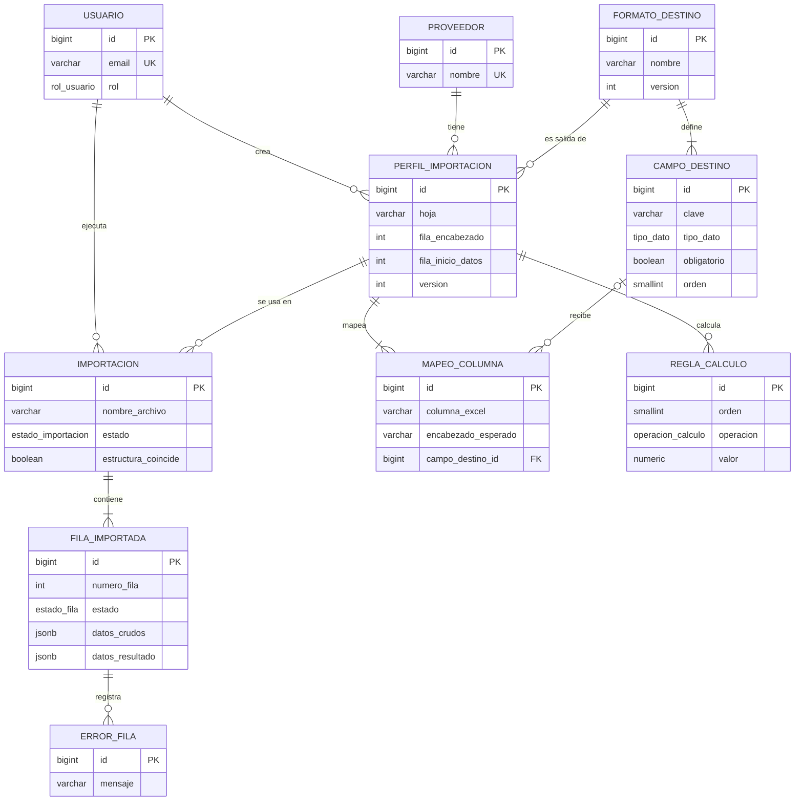

# Base de datos

[← README](../README.md)

**Motor:** PostgreSQL. Script: [`database/schema.sql`](../database/schema.sql) · Datos de ejemplo: [`database/seed.sql`](../database/seed.sql)

## Por qué PostgreSQL

Los datos del sistema (usuarios, proveedores, perfiles, importaciones, errores) tienen estructura fija y están relacionados entre sí. Lo único que cambia según el proveedor es la fila original del Excel, y eso se guarda en una columna `JSONB`. Por eso alcanza con una sola base relacional.

## Diagrama

## Tablas

| Tabla | Qué guarda |
| --- | --- |
| `usuario` | Usuarios del sistema (admin u operador) |
| `proveedor` | Proveedores que envían listas |
| `formato_destino` / `campo_destino` | Formato que acepta el sistema destino y sus columnas |
| `perfil_importacion` | Contrato de una hoja: hoja, fila de encabezados y fila de inicio |
| `mapeo_columna` | Columna del Excel → campo destino (o ignorada) y sus transformaciones |
| `regla_calculo` | Cálculos en orden (IIBB, ganancia, IVA…) |
| `importacion` | Historial: qué archivo, quién, cuándo, resultado |
| `fila_importada` | Cada fila leída, original y transformada |
| `error_fila` | Motivo de rechazo de una fila |

## Decisiones

- **Cambio de formato:** `encabezado_esperado` se compara con el archivo nuevo. Si no coincide, se avisa antes de procesar.
- **Versiones de perfil:** si el proveedor cambia su lista, se crea una versión nueva y el historial viejo no se toca.
- **Tiempo de guardado:** las importaciones se borran a los 90 días (`expira_en`).
- **Cálculos acotados:** solo las operaciones del tipo `operacion_calculo`, sin fórmulas libres.
