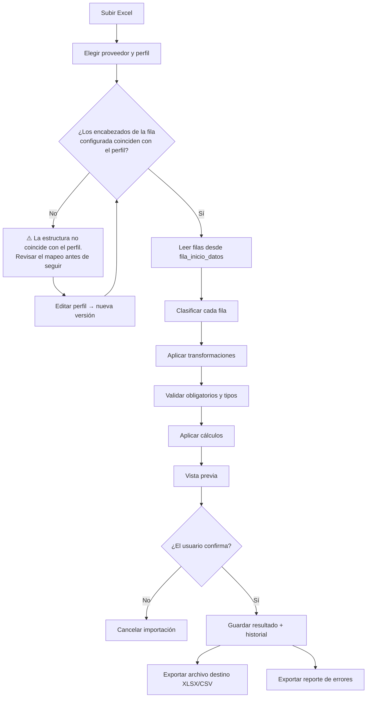
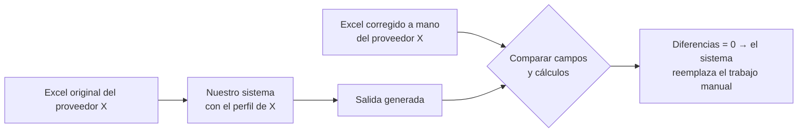

# Contrato de importación

[← Volver al README](../README.md)

> **El sistema no promete interpretar cualquier Excel. Procesa correctamente los archivos que cumplen un contrato configurado de antemano.**
> (Devolución del 25/08)

El contrato se guarda como un **perfil de importación**: uno por proveedor y por hoja. El usuario lo configura la primera vez y después el sistema lo aplica siempre igual.

---

## 1. Qué define un perfil

| Elemento | Dónde se guarda | Ejemplo (Ferretería) |
| --- | --- | --- |
| Proveedor | `perfil_importacion.proveedor_id` | Ferretería (lista LSTPRE) |
| Hoja | `perfil_importacion.hoja` | `LSTPRE` |
| Fila de encabezados | `perfil_importacion.fila_encabezado` | 7 |
| Primera fila de datos | `perfil_importacion.fila_inicio_datos` | 8 (el primer producto está en la 12; se lee desde la 8 para tomar el título de la fila 10 como categoría) |
| Qué representa cada columna | `mapeo_columna` | A → codigo, B → producto, C → precio_costo |
| Columnas ignoradas | `mapeo_columna.ignorar` | D (`CON_IVA`), E (`TIP_LST`) |
| Campos obligatorios y tipos | `campo_destino` (del formato destino) | codigo, producto: texto; precio_costo: decimal |
| Transformaciones | `transformacion` | codigo → TRIM; precio → A_DECIMAL |
| Cálculos | `regla_calculo` | ingreso_bruto = precio_costo + 4 %… |
| Formato de salida | `perfil_importacion.formato_destino_id` | `plataforma_anterior` v1 |
| Filas título como categoría | `perfil_importacion.titulos_como_categoria` | sí |

Escrito como contrato:

```yaml
proveedor: Ferretería (lista LSTPRE)
hoja: LSTPRE
fila_encabezado: 7
fila_inicio_datos: 8
columnas:
  A: { encabezado: CODIGO,  campo: codigo,       transformaciones: [TRIM] }
  B: { encabezado: DESCRIP, campo: producto,     transformaciones: [TRIM] }
  C: { encabezado: PRECIO,  campo: precio_costo, transformaciones: [A_DECIMAL] }
  D: { encabezado: CON_IVA, ignorar: true }
  E: { encabezado: TIP_LST, ignorar: true }
calculos:
  - ingreso_bruto = SUMAR_PORCENTAJE(precio_costo, 0.04)
  - ganancia      = SUMAR_PORCENTAJE(ingreso_bruto, 0.50)
  - iva           = MULTIPLICAR(ganancia, 0.21)
  - costo_mas_iva = SUMAR_CAMPO(ganancia, iva)
  - precio_venta  = SUMAR_PORCENTAJE(costo_mas_iva, 0.30)
salida: plataforma_anterior v1
```

> Los porcentajes son los de `KALLAYCORREGIDO.xlsx`, porque Ferretería no tiene planilla corregida. **Hay que confirmarlos con el negocio.**

---

## 2. Operaciones soportadas (P0)

Es un conjunto **cerrado**. Si una transformación no está en la lista, el sistema dice que no la puede hacer y no intenta resolverla.

### Transformaciones de valor (se aplican a una celda)

| Operación | Efecto |
| --- | --- |
| `TRIM` | Quita espacios al inicio y al final |
| `MAYUSCULAS` | Pasa el texto a mayúsculas |
| `A_DECIMAL` | Convierte texto a número respetando el separador decimal del perfil (`1.474,41` o `1474.41`) |
| `A_ENTERO` | Convierte a entero |
| `QUITAR_PREFIJO` | Quita un prefijo fijo (`COD. 504` → `504`) |

### Cálculos (generan un campo destino)

| Operación | Fórmula |
| --- | --- |
| `COPIAR` | r = base |
| `VALOR_FIJO` | r = valor |
| `SUMAR_PORCENTAJE` | r = base × (1 + v) |
| `RESTAR_PORCENTAJE` | r = base × (1 − v) |
| `MULTIPLICAR` | r = base × v |
| `DIVIDIR` | r = base ÷ v (v ≠ 0) |
| `APLICAR_IVA` | r = base × (1 + alícuota) |
| `SUMAR_CAMPO` | r = base + otro campo *(se agregó porque `costo + iva` lo necesita)* |
| `CONCATENAR` | r = base + texto + otro campo |

Los cálculos se ejecutan **en el orden configurado**: cada uno puede usar el resultado de los anteriores. No hay expresiones libres ni fórmulas escritas por el usuario.

---

## 3. Flujo de una importación



### Clasificación de filas

| Condición | Estado | Motivo |
| --- | --- | --- |
| Todas las columnas mapeadas vacías | `IGNORADA` | `FILA_VACIA` |
| Sin código ni precio, pero con texto | `IGNORADA` | `ENCABEZADO_INTERNO` (si el perfil lo indica, pasa a ser la categoría de las filas siguientes) |
| Falta un campo obligatorio o el tipo no es válido | `ERROR` | `OBLIGATORIO_AUSENTE`, `TIPO_INVALIDO`… |
| Un cálculo falla (por ejemplo, división por 0) | `ERROR` | `CALCULO_INVALIDO` |
| Todo lo demás | `VALIDA` | — |

### Detección de cambio de formato

Antes de procesar, el sistema compara los encabezados de `fila_encabezado` con `mapeo_columna.encabezado_esperado` (sin distinguir mayúsculas ni espacios). Si no coinciden:

- se guarda `importacion.estructura_coincide = false` y las diferencias en `importacion.diferencias`;
- **no se aplica el perfil sin avisar**: se muestra la advertencia y el usuario revisa el mapeo.

---

## 4. Vista previa (diseño)

```
Archivo: Lista Ferreteria 19 08.xlsx          Perfil: Lista general v1
Hoja: LSTPRE     Encabezados: fila 7 ✔ coinciden con el perfil

Filas leídas: 1953   Válidas: 1412   Ignoradas: 541   Con error: 0

 Fila │ Código │ Producto                   │ Costo    │ Venta    │ Estado
──────┼────────┼────────────────────────────┼──────────┼──────────┼──────────────────────
   10 │   —    │ PILAS ENERGIZER ALCALINAS  │    —     │    —     │ Ignorada: encabezado interno
   12 │ EP52   │ ENERGIZER AA BLISTER X 1   │ 1474,41  │ 3618,03  │ ✔ Correcto
   13 │ EP71   │ ENERGIZER AA BLISTER X 4   │ 1474,41  │ 3618,03  │ ✔ Correcto
  ... │ X125   │ Producto X                 │ ABC      │    —     │ ✖ Error: precio no numérico

                         [ Ver solo errores ]  [ Cancelar ]  [ Confirmar importación ]
```

`Venta` = 1474,41 × 1,04 × 1,50 × 1,21 × 1,30 = 3618,03. Es la misma cadena de fórmulas del Excel corregido de KALLAY.

---

## 5. Reporte de filas rechazadas

Las filas con error **no se pierden**: quedan en `fila_importada` + `error_fila` y se pueden descargar.

| fila | código | columna | campo | error | valor original |
| --- | --- | --- | --- | --- | --- |
| 248 | ABC45 | C | precio_costo | precio no numérico | `ABC` |
| 617 | — | A | codigo | código obligatorio ausente | |
| 1032 | X77 | B | producto | descripción vacía | |

El archivo de errores se exporta como XLSX/CSV con estas columnas, más los datos crudos de la fila, para que el usuario pueda corregirlo.

---

## 6. Caso de aceptación "antes / después"



Se va a automatizar como test de integración (ver [módulos](modulos.md), M9). **Pendiente:** conseguir el par original/corregido del mismo proveedor.
