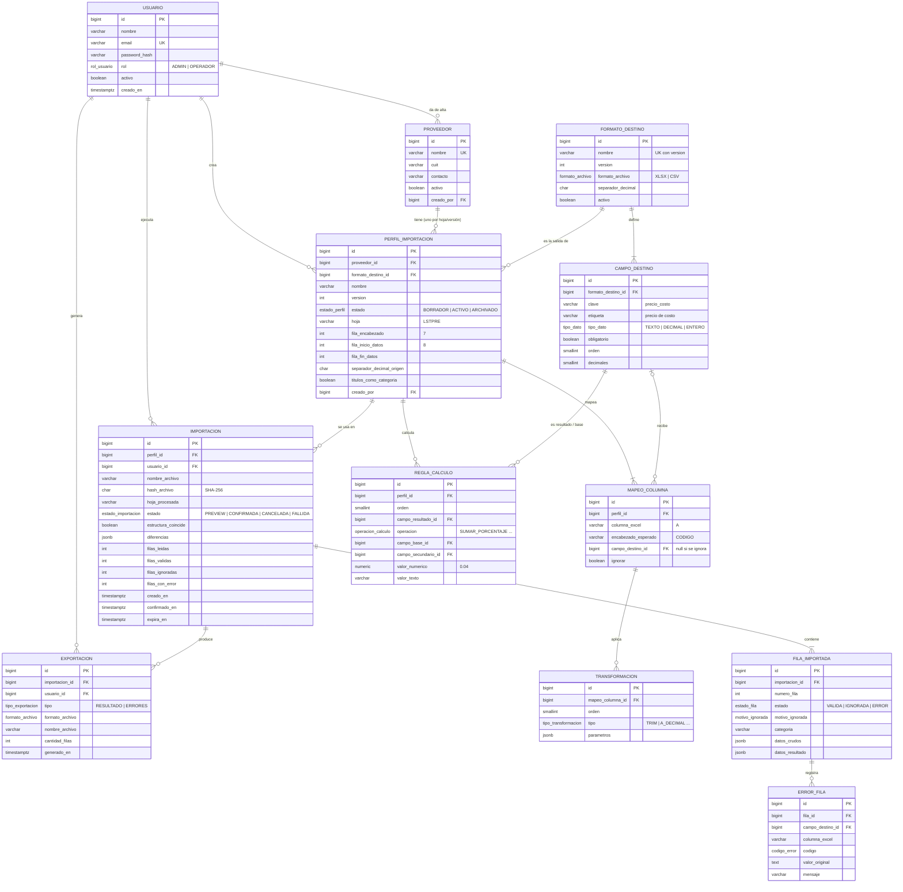
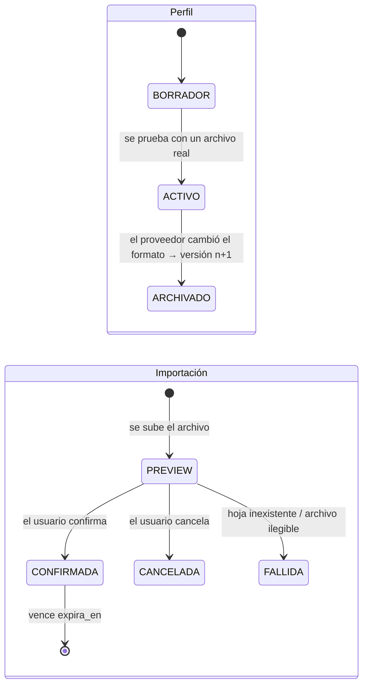

# Esquema de base de datos

[← Volver al README](../README.md) · **2.ª Entrega — Diseño y Módulos**

- **Motor:** PostgreSQL (relacional), con columnas `JSONB` solo donde el contenido depende de cada proveedor.
- **DDL completo:** [`database/schema.sql`](../database/schema.sql)
- **Datos de ejemplo** (formato destino + perfil del primer caso real): [`database/seed.sql`](../database/seed.sql)

---

## 1. Por qué PostgreSQL (y no MongoDB)

En las dos devoluciones, el tutor preguntó qué heterogeneidad justificaba MongoDB si después del proceso los datos quedan normalizados. Al rediseñar sobre el dataset real, la respuesta es que **casi todo el dominio es relacional y tiene estructura fija**:

| Entidad | ¿Estructura fija? | Relaciones |
| --- | --- | --- |
| usuarios, proveedores | Sí | proveedor → perfiles |
| formato destino y sus campos | Sí | campos → mapeos, cálculos |
| perfil (hoja, filas, mapeos, transformaciones, cálculos) | **Sí**: lo que varía es el *contenido*, no la *forma* | perfil → mapeos → transformaciones |
| importaciones, errores, exportaciones | Sí | importación → filas → errores |
| **fila cruda del Excel** | **No**: columnas distintas por proveedor | → `JSONB` |
| **resultado por fila** | Depende de los campos del formato destino | → `JSONB`, validado contra `campo_destino` |

Además hay **integridad referencial real**: un mapeo apunta a un campo del formato destino, un cálculo a campos existentes y un error a una fila de una importación. Con claves foráneas y `CHECK` eso lo garantiza la base, no el código.

El único dato que de verdad varía es la fila cruda, y `JSONB` lo resuelve sin sumar un segundo motor. Se usa **una sola base**, como sugirió el tutor.

---

## 2. Diagrama entidad-relación



---

## 3. Descripción de las tablas

### Configuración (el "contrato")

| Tabla | Para qué sirve | Reglas de integridad principales |
| --- | --- | --- |
| `usuario` | Login y autoría (quién importó qué) | `email` único; contraseña con BCrypt |
| `proveedor` | Origen de las listas | `nombre` único |
| `formato_destino` | Lo que espera el sistema destino (hoy: `plataforma_anterior` v1) | `(nombre, version)` único |
| `campo_destino` | Conceptos del dominio: código, producto, precio de costo, IVA, stock… | `(formato, clave)` y `(formato, orden)` únicos |
| `perfil_importacion` | Hoja, fila de encabezado, fila inicial y opciones de lectura | `fila_inicio_datos > fila_encabezado`; **un solo perfil `ACTIVO`** por proveedor y nombre (índice parcial) |
| `mapeo_columna` | Columna del Excel → campo destino, o *ignorar* | Mapea **o** ignora (`CHECK`); un campo destino se alimenta de una sola columna |
| `transformacion` | Transformaciones ordenadas por columna (`TRIM`, `A_DECIMAL`…) | `(mapeo, orden)` único |
| `regla_calculo` | Cálculos ordenados (conjunto cerrado de operaciones) | Cada operación exige sus operandos (`CHECK`); `DIVIDIR` no admite 0 |

### Ejecución (el historial)

| Tabla | Para qué sirve | Reglas de integridad principales |
| --- | --- | --- |
| `importacion` | Una carga de archivo: quién, cuándo, con qué perfil y resultado | `filas_leidas = válidas + ignoradas + con error`; `CONFIRMADA` exige `confirmado_en` |
| `fila_importada` | Cada fila leída con sus datos crudos y su resultado | Una fila `VALIDA` tiene resultado; una `IGNORADA` tiene motivo |
| `error_fila` | Motivo de rechazo por campo (fila 248: precio no numérico) | Se borra en cascada con la fila |
| `exportacion` | Registro de cada archivo descargado (resultado o errores) | El archivo se genera a demanda y no se guarda |

---

## 4. Decisiones de diseño

1. **Versionado de perfiles.** Si el proveedor cambia el formato, no se edita el perfil en uso: se crea la versión `n+1` y la anterior pasa a `ARCHIVADO`. Las importaciones viejas siguen apuntando a la versión con la que se procesaron, y así la trazabilidad se mantiene.
2. **Detección de cambio de estructura.** `mapeo_columna.encabezado_esperado` guarda el encabezado que tenía cada columna al crear el perfil. En cada importación se compara con el archivo y el resultado queda en `importacion.estructura_coincide` / `diferencias`.
3. **La vista previa también se persiste.** La importación nace en `PREVIEW` con todas sus filas. Confirmar solo cambia el estado; cancelar la marca `CANCELADA`. Así la vista previa y el resultado final no pueden diferir.
4. **Tiempo de guardado.** `importacion.expira_en` (90 días por defecto) responde a "por cuánto tiempo se persiste en el sistema" del MVP. Una tarea programada borra las importaciones vencidas y sus filas en cascada.
5. **Archivo repetido.** `hash_archivo` (SHA-256) permite avisar "este archivo ya se importó el 19/08".
6. **Qué no se guarda.** El Excel original no se guarda en la base (solo nombre y hash). Los archivos exportados tampoco: se regeneran desde `fila_importada`.
7. **Sin multitenancy.** No hay `tenant_id`. Es una evolución futura (ver [problema y alcance](problema-y-alcance.md#6-mvp-y-evoluciones)).

---

## 5. Ciclo de vida



---

## 6. Ejemplo de una fila persistida

Fila 12 de `Lista Ferreteria 19 08.xlsx` después de procesarla con el perfil de [`seed.sql`](../database/seed.sql):

```json
{
  "numero_fila": 12,
  "estado": "VALIDA",
  "categoria": "PILAS ENERGIZER ALCALINAS",
  "datos_crudos":    { "A": "EP52", "B": "ENERGIZER AA BLISTER X 1", "C": 1474.41, "D": 1784.04, "E": null },
  "datos_resultado": {
    "codigo": "EP52", "producto": "ENERGIZER AA BLISTER X 1",
    "precio_costo": 1474.41, "ingreso_bruto": 1533.39, "ganancia": 2300.08,
    "iva": 483.02, "costo_mas_iva": 2783.10, "stock": null, "precio_venta": 3618.03
  }
}
```

(El motor calcula sin redondear y redondea solo al exportar, según `campo_destino.decimales`.)
