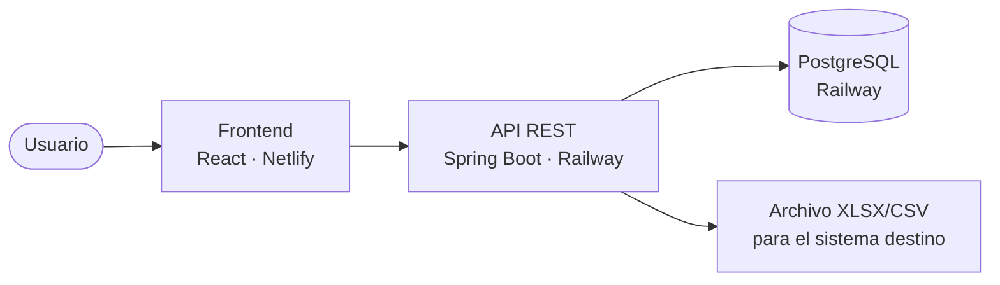
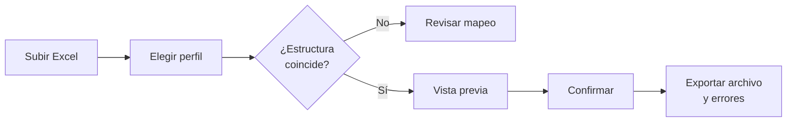

# Módulos

[← README](../README.md)

## Arquitectura

## Listado

| # | Módulo | Qué hace | Prioridad |
| --- | --- | --- | --- |
| 1 | Usuarios | Login e historial por usuario | MVP |
| 2 | Proveedores | Alta, edición y baja de proveedores | MVP |
| 3 | Formato destino | Columnas que acepta el sistema destino | MVP |
| 4 | Perfiles de importación | Hoja, filas, mapeo de columnas y cálculos por proveedor | MVP |
| 5 | Lectura de Excel | Lee hojas y filas del archivo (Apache POI) | MVP |
| 6 | Motor de transformación | Clasifica filas, valida, transforma y calcula | MVP |
| 7 | Importaciones | Vista previa, confirmación e historial | MVP |
| 8 | Exportación | Archivo final y reporte de filas con error | MVP |
| 9 | Frontend | Pantallas para operar todo lo anterior | MVP |
| 10 | Plantilla conocida | Importar archivos que ya vienen en el formato destino | Opcional |

## Flujo principal

## Operaciones de cálculo

Conjunto cerrado: copiar, valor fijo, sumar %, restar %, multiplicar, dividir, sumar campo y concatenar.

## Plan

| Fechas | Trabajo |
| --- | --- |
| hasta 27/09 | 2.ª entrega + prueba de despliegue |
| 28/09 – 11/10 | Módulos 2 a 6 |
| 12/10 – 25/10 | Módulos 7, 8 y 9 |
| 26/10 – 08/11 | Módulo 1, pruebas con el dataset y despliegue final |
| 09/11 – 14/11 | Informe, video y entrega final |

**Fuera del alcance:** multitenancy, stock, ventas y conversión de monedas o unidades.
