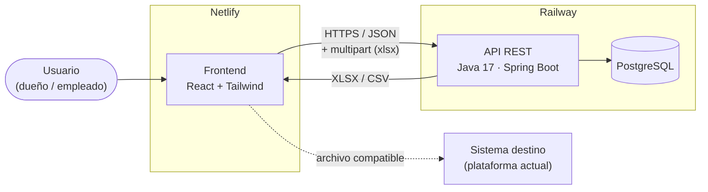
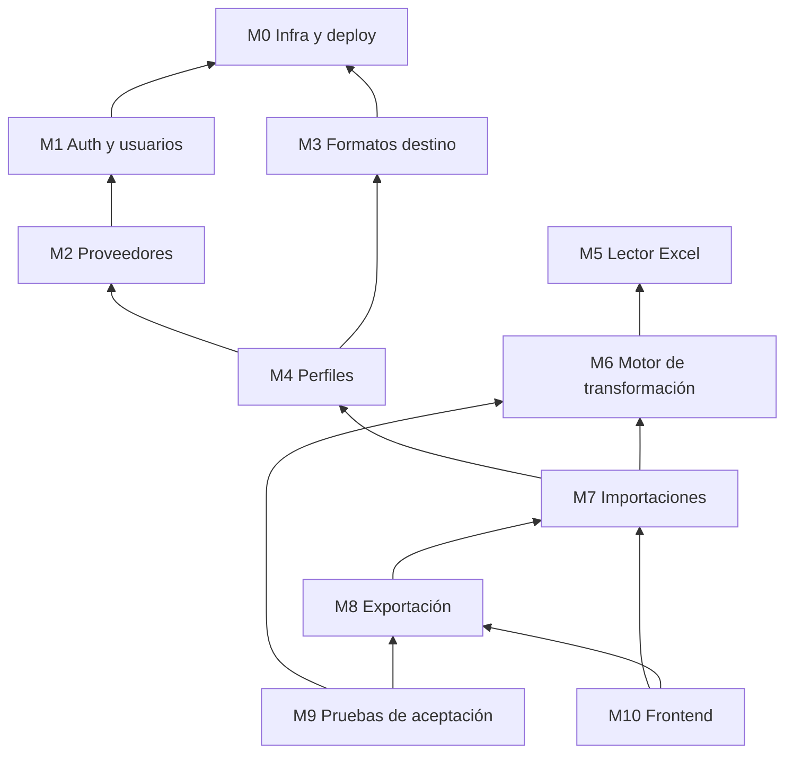
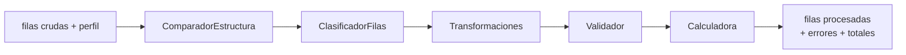
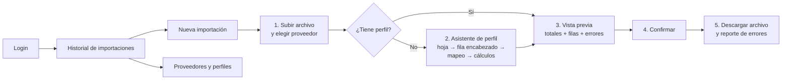

# Módulos a desarrollar

[← Volver al README](../README.md) · **2.ª Entrega — Diseño y Módulos**

**Prioridad:** **P0** = indispensable para el MVP (sin esto no se resuelve el problema) · **P1** = se hace si el P0 está terminado · **Futuro** = fuera de esta versión.

Criterio del tutor para cada módulo: *¿qué parte del problema dejaríamos de resolver si lo quitamos?*

---

## 1. Arquitectura



- **Monolito modular:** una sola aplicación Spring Boot, dividida en paquetes por módulo. Para la escala del problema no hacen falta microservicios.
- El **motor (M6) no depende de Spring ni de la base**: recibe filas y un perfil y devuelve filas procesadas. Así se puede probar con los Excels reales sin levantar nada más.

---

## 2. Listado de módulos

| # | Módulo | Prioridad | ¿Qué deja de resolverse sin él? |
| --- | --- | --- | --- |
| **M0** | Infraestructura y deploy | P0 | No hay forma de usar el sistema; el riesgo de Railway queda para el final |
| **M1** | Autenticación y usuarios | P0 (login) / P1 (ABM) | No se sabe *quién* importó qué (lo pide el MVP) |
| **M2** | Proveedores | P0 | Los perfiles no tienen a qué asociarse |
| **M3** | Formatos destino | P0 | No hay salida definida: no se sabe qué archivo generar |
| **M4** | Perfiles de importación | P0 | Hay que configurar todo cada vez: se pierde la automatización |
| **M5** | Lector de Excel | P0 | No se pueden leer las planillas |
| **M6** | Motor de transformación | P0 | Es el núcleo: mapeo, validación y cálculos |
| **M7** | Importaciones e historial | P0 | Sin vista previa ni trazabilidad |
| **M8** | Exportación y reporte de errores | P0 | El flujo no termina en un archivo utilizable |
| **M9** | Pruebas de aceptación con el dataset | P0 | No hay evidencia de que reemplaza el trabajo manual |
| **M10** | Frontend | P0 | El usuario no técnico no puede operar |

### Dependencias



---

## 3. Detalle por módulo

### M0 — Infraestructura y deploy · P0

- Repo con `backend/`, `frontend/`, `database/`, `docs/`.
- **Prueba de punta a punta en las semanas 1–2** (pedido del tutor): frontend mínimo → API → PostgreSQL → desplegado, respondiendo "OK – Sistema funcionando" (`GET /api/health`).
- Migraciones con **Flyway** a partir de [`database/schema.sql`](../database/schema.sql).
- CI con GitHub Actions: build + tests en cada PR.

### M1 — Autenticación y usuarios · P0 / P1

| Endpoint | Descripción | Prioridad |
| --- | --- | --- |
| `POST /api/auth/login` | Devuelve un JWT | P0 |
| `GET /api/auth/me` | Usuario actual | P0 |
| `GET/POST/PUT /api/usuarios` | ABM de usuarios (solo `ADMIN`) | P1 |

Roles: `ADMIN` (usuarios y formatos destino) y `OPERADOR` (proveedores, perfiles, importaciones). **Sin multitenancy.**

### M2 — Proveedores · P0

`GET/POST/PUT /api/proveedores` · ABM simple con baja lógica (`activo`).

### M3 — Formatos destino · P0 / P1

| Funcionalidad | Prioridad |
| --- | --- |
| Formato `plataforma_anterior` v1 precargado (seed) y consulta de sus campos | P0 |
| ABM de formatos y campos | P1 |
| **Opción 1 — formato conocido:** descargar la plantilla vacía del formato; un archivo que ya viene en ese formato se importa con un perfil "identidad" sin mapear | P1 |

### M4 — Perfiles de importación · P0

| Endpoint | Descripción |
| --- | --- |
| `POST /api/perfiles` | Crear perfil: hoja, filas, mapeos, transformaciones, cálculos |
| `GET /api/proveedores/{id}/perfiles` | Perfiles de un proveedor |
| `POST /api/perfiles/{id}/versiones` | Nueva versión (la anterior pasa a `ARCHIVADO`) |
| `POST /api/perfiles/{id}/activar` | `BORRADOR` → `ACTIVO` |

Valida que los cálculos solo usen operaciones del conjunto cerrado y campos del formato destino ([contrato](contrato-de-importacion.md#2-operaciones-soportadas-p0)).

### M5 — Lector de Excel · P0

- **Apache POI.** Lista las hojas, lee la fila de encabezados N y recorre las filas desde M.
- Devuelve cada fila como `Map<columna, valor>` con el número de fila real.
- Evalúa fórmulas (la hoja `Hoja1` de Cuenta 2 tiene `=B2*1.4`).
- Lectura en streaming para libros grandes (`LISTAS CUENTA 2` pesa 8,5 MB).
- `POST /api/archivos/inspeccionar` → hojas + primeras 20 filas para que el usuario elija la fila de encabezado.

### M6 — Motor de transformación · P0 (núcleo)

Java puro, sin dependencias de Spring ni de la base.



| Componente | Responsabilidad |
| --- | --- |
| `ComparadorEstructura` | Encabezados del archivo vs. `encabezado_esperado` → coincide / diferencias |
| `ClasificadorFilas` | Vacía / título (categoría) / producto |
| `Transformaciones` | `TRIM`, `MAYUSCULAS`, `A_DECIMAL`, `A_ENTERO`, `QUITAR_PREFIJO` |
| `Validador` | Obligatorios y tipos según `campo_destino` |
| `Calculadora` | Ejecuta `regla_calculo` en orden con `BigDecimal` |

Las operaciones se implementan con un `enum` + patrón *Strategy*. Agregar una operación es agregar un valor, no escribir un intérprete.

### M7 — Importaciones e historial · P0

| Endpoint | Descripción |
| --- | --- |
| `POST /api/importaciones` (multipart) | Sube el archivo con un perfil → procesa → queda en `PREVIEW` |
| `GET /api/importaciones/{id}` | Resumen: leídas / válidas / ignoradas / con error, y si la estructura coincide |
| `GET /api/importaciones/{id}/filas?estado=ERROR` | Filas paginadas para la vista previa |
| `POST /api/importaciones/{id}/confirmar` · `/cancelar` | Cambio de estado |
| `GET /api/importaciones` | Historial: qué, cuándo, quién, con qué perfil |

Tarea programada (P1): borrar las importaciones con `expira_en` vencido.

### M8 — Exportación y reporte de errores · P0

| Endpoint | Salida |
| --- | --- |
| `GET /api/importaciones/{id}/exportar?formato=XLSX\|CSV` | Archivo compatible con el sistema destino (columnas y orden de `campo_destino`) |
| `GET /api/importaciones/{id}/errores?formato=XLSX\|CSV` | Fila, código, columna, campo, error, valor original + datos crudos |

Solo exporta importaciones `CONFIRMADA`. Cada descarga queda registrada en `exportacion`.

### M9 — Pruebas de aceptación con el dataset · P0

- Tests de integración (JUnit) que procesan `dataset-example/` con perfiles reales y verifican los conteos (Ferretería: **1412 válidas, 541 ignoradas**).
- **Test "antes / después":** se genera la salida y se compara campo por campo contra el Excel corregido a mano, con una tolerancia de ±0,01.
- Test de cambio de formato: el perfil de Ferretería aplicado a otra hoja tiene que dar `estructura_coincide = false`.

### M10 — Frontend · P0



---

## 4. Estructura del repositorio

```
TPIFinalDesiderioVazquez/
├── backend/                         Spring Boot (Maven)
│   └── src/main/java/.../tpi/
│       ├── auth/        M1
│       ├── usuario/     M1
│       ├── proveedor/   M2
│       ├── formato/     M3
│       ├── perfil/      M4
│       ├── lector/      M5
│       ├── motor/       M6  (sin dependencias de Spring)
│       ├── importacion/ M7
│       └── exportacion/ M8
│   └── src/test/...     M9
├── frontend/                        React + Vite + Tailwind   M10
├── database/                        schema.sql, seed.sql → migraciones Flyway
├── dataset-example/                 Excels reales (casos de prueba)
└── docs/                            documentación en Markdown
```

---

## 5. Plan de trabajo por módulo (31/08 – 21/11)

| Semanas | Módulos | Entregable verificable |
| :---: | --- | --- |
| 1–2 | M0 | App desplegada en Railway + Netlify respondiendo "OK" contra PostgreSQL |
| 3–4 | M5, M6 (clasificador y transformaciones), M9 | Ferretería leída y clasificada en un test: 1412 / 541 |
| 5–6 | M2, M3, M4, M6 (validador y calculadora) | Perfil de Ferretería persistido; cálculos iguales a KALLAY |
| 7–8 | M7, M8, M10 (vista previa y exportación) | Recorrido completo: subir → vista previa → confirmar → exportar |
| 9 | M3 (Opción 1), detección de cambio de formato | Advertencia de estructura distinta |
| 10 | M1, historial | Login + historial con usuario |
| 11 | M9 (antes / después), deploy final, documentación | Evidencia de comparación |
| 12 | Buffer | Entrega 21/11 |

### Futuro (fuera del MVP)

Multitenancy · stock y ventas · matching de productos entre proveedores · conversión de moneda y unidades · IVA por producto · integración por API con el sistema destino · app móvil.
