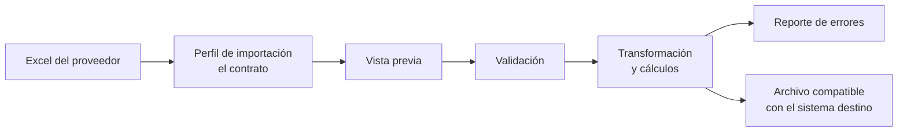

# Problema y alcance

[← Volver al README](../README.md) · Versión vigente, actualizada con la devolución del 25/08. La versión original está en [entregas/entrega-1.md](entregas/entrega-1.md).

---

## 1. Problema

Los dueños de pequeños negocios reciben listas de precios en Excel de varios proveedores. Cada una trae estructura, nombres de columna y formatos distintos. Hoy esas listas se **transcriben y corrigen a mano** en una planilla con el formato fijo que acepta su sistema.

- **Tiempo:** entre 2 y 3 horas semanales.
- **Carga mental:** "otra vez con los Excels que tengo que arreglar".
- **Errores:** precios, códigos y stock mal traspasados.

**Transformación manual actual** (se ve en [`dataset-previous-platform`](../dataset-example/dataset-previous-platform)):

1. Se ubica en el Excel del proveedor dónde están el código, la descripción y el precio.
2. Se copian a la planilla destino: `codigo | producto | precio de costo | …`.
3. Se cargan los porcentajes de **ese** proveedor (Ingresos Brutos, ganancia, IVA, % adicional).
4. Las fórmulas calculan los precios finales.

Es decir, el problema no es solo **mapear columnas**: también hay que **interpretar la estructura** y **aplicar cálculos**. El detalle está en [análisis del dataset](analisis-dataset.md).

### Actores

| Actor | Rol |
| --- | --- |
| Dueño o empleado del negocio | Configura perfiles, importa y exporta. No es técnico. |
| Proveedores | Generan las listas en su formato. **No cambian nada**: el sistema se adapta a ellos. |
| Sistema destino | Recibe el archivo final. No se integra por API. |

---

## 2. Solución

> **Motor configurable para importación, homologación, transformación y exportación de listas de productos de distintos proveedores.**

- **Dominio acotado:** listas comerciales de productos. Los conceptos (código, producto, precio de costo, IVA, stock, categoría…) están definidos, y el usuario configura *cómo se obtiene* cada uno.
- **No se adivina:** el sistema procesa los archivos que cumplen un [contrato configurado](contrato-de-importacion.md). Si no lo cumplen, lo informa.
- **Primera vez / siguientes:** la primera lista de un proveedor se configura con un asistente. Las siguientes reutilizan el perfil y, si la estructura cambió, el sistema avisa.

## 3. Qué significa "homologar" en este proyecto

Homologar es, para una hoja de un proveedor:

1. **Interpretar la estructura:** qué hoja, en qué fila están los encabezados, desde qué fila empiezan los datos y qué filas no son productos.
2. **Mapear:** relacionar cada columna útil con un concepto del formato destino e ignorar las demás.
3. **Normalizar valores:** separador decimal, espacios, tipos.
4. **Calcular** los campos que el formato destino exige y el proveedor no trae, con un conjunto cerrado de operaciones.

**No incluye** (evolución futura): detectar que dos productos de proveedores distintos son el mismo, convertir unidades o monedas, ni unificar categorías entre proveedores.

## 4. Stack

| Capa | Tecnología | Motivo |
| --- | --- | --- |
| Backend | Java 17 · Spring Boot · Apache POI | Es el lenguaje donde el equipo se siente más seguro; POI es el estándar para leer y escribir Excel |
| Frontend | React · Vite · Tailwind | Franco: nivel intermedio/avanzado |
| Base de datos | **PostgreSQL** (+ `JSONB`) | Ver [justificación](esquema-base-de-datos.md#1-por-qué-postgresql-y-no-mongodb) |
| Deploy | Netlify (frontend) · Railway (API + PostgreSQL) | Se prueba en las semanas 1–2 |

### Nivel del equipo

| Tecnología | Franco | Lucas |
| --- | --- | --- |
| React + Tailwind | Intermedio/avanzado | Básico/inicial |
| Java / Spring Boot | Básico/inicial | Básico/inicial |
| MongoDB | Intermedio/avanzado | Básico/inicial |
| PostgreSQL | *a completar* | *a completar* |
| Netlify | Intermedio/avanzado | Básico/inicial |
| Railway | Sin experiencia | Sin experiencia |

## 5. Criterios de éxito del MVP

- Procesar `Lista Ferreteria 19 08.xlsx` (hoja `LSTPRE`) y **reutilizar el perfil** con una lista nueva del mismo proveedor.
- Informar cada fila rechazada con número de fila, campo y motivo.
- Advertir cuando el archivo no coincide con el perfil.
- Generar un archivo que coincida con la planilla corregida a mano (caso antes/después) en campos y cálculos.
- Consolidar una lista pasa de horas a minutos.

## 6. MVP y evoluciones

**MVP (P0):** subir Excel → elegir hoja → indicar filas → mapear columnas → vista previa → procesar válidos → informar rechazados → aplicar cálculos → exportar. Además: login, proveedores, perfiles reutilizables e historial (qué, cuándo, quién y hasta cuándo se guarda).

**Evoluciones (fuera del MVP):**

| Evolución | Por qué queda afuera |
| --- | --- |
| Multitenancy / SaaS | Sirve para vender el producto a muchos negocios, no para resolver el problema de un negocio hoy |
| Stock y ventas | Ya lo resuelven los ERP (Xubio, Tango, Odoo); el producto **complementa** al ERP |
| Matching entre proveedores, unidades, monedas | Suma mucha complejidad y no se necesita para generar el archivo destino |
| Integración por API con el sistema destino | Con el archivo XLSX/CSV ya se resuelve el problema |
| "Sincronización bidireccional" | Se reemplaza por **exportación y reimportación controlada** |

## 7. Riesgos

| Riesgo | Mitigación |
| --- | --- |
| Curva de aprendizaje (Spring Boot, Railway, React para Lucas) | Deploy de punta a punta en las semanas 1–2; pair programming |
| Formatos más raros de lo previsto (bloques verticales, celdas combinadas) | Contrato explícito: lo que no cumple se rechaza, no se adivina |
| Porcentajes y reglas mal relevados | Validar con el caso antes/después sobre planillas reales |
| Libros grandes (8,5 MB) | Lectura en streaming con POI |
